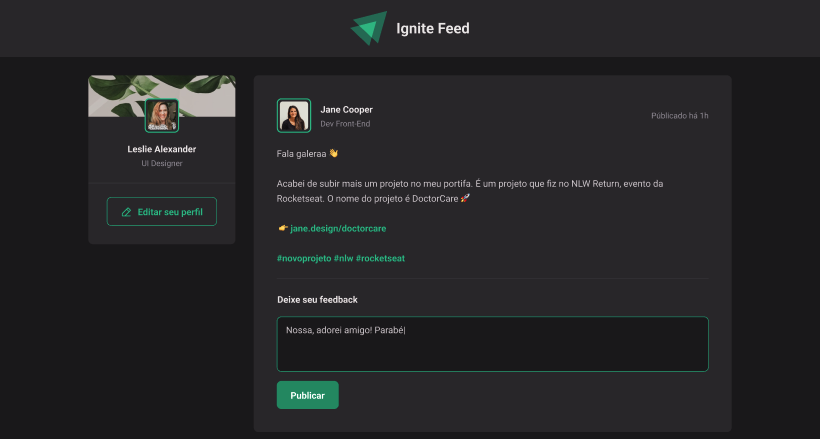

<!-- 
  npm install phosphor-react (https://phosphoricons.com/) 
-->

<p align="center">
  <a href="#-layout">Layout</a> •
  <a href="#-technologies">Technologies</a> •
  <a href="#-getting-started">Getting started</a> •
</p>

## :framed_picture: Imagens ##

<h1 align="center">
    
</h1>

## 🔖 About this project

in progress...

## 🚀 Technologies

- [React](https://reactjs.org/)
- [Vitejs](https://vitejs.dev/)
- [Phosphor icons](https://phosphoricons.com/)
- [in progress...]()

## 💻 Getting started

### Requirements

- [Node.js](https://nodejs.org/en/)
- [Yarn](https://classic.yarnpkg.com/) or [npm](https://www.npmjs.com/package/npm)

**Clone the project and access the folder**

```bash
git clone git@github.com:tiagopires123/ignite-feed.git && cd ignite-feed
```

**Follow the steps below**

### Server

```bash
# From the project root folder access the 'server' folder
$ cd ignite-feed

# Install the dependencies
$ npm install

# Make a copy of '.env.example' to '.env.local'
# and set with YOUR environment variables from GraphCMS (https://graphcms.com/).
$ cp .env.example .env.local

# Start the server
$ npm run dev
```

---

### Links
- [Home page](https://ignite-feed-phi.vercel.app/?)

<p align="center">
  Made with 💜
</p>